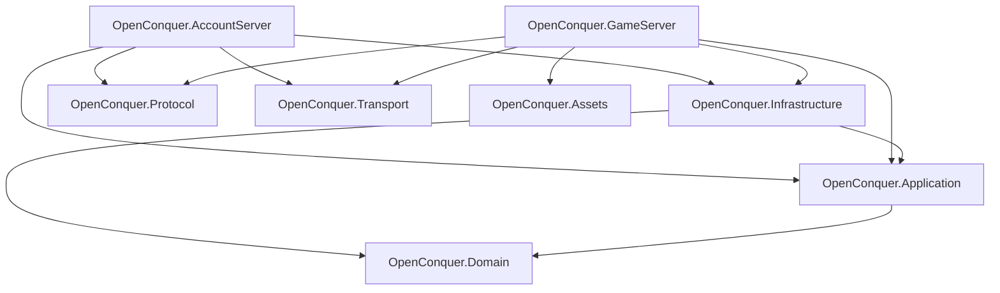

# OpenConquer Server

OpenConquer Server is an open source server emulator for **Conquer Online 5517**, rebuilt in C# on
**.NET 10**.

The goal of this project is to have a complete and accurate recreation of the live game servers from
Conquer Online while the client was in version 5517. While faithful parity is the ultimate baseline
goal for the project, the plan is to design it in a way that is easily customizable and extensible.

> **Status:** Early development. The server is being rebuilt from the ground up in focused, fully
> tested implementation slices.

## Architecture

OpenConquer is designed as a modular monolith with two executable hosts and a small set of focused
libraries.



### Projects

- **OpenConquer.Domain** contains game and account rules, models, value objects, and invariants.
- **OpenConquer.Application** owns use cases, authoritative world execution, commands,
  orchestration, and infrastructure contracts.
- **OpenConquer.Infrastructure** implements persistence and external dependencies, including the
  account and game database boundaries.
- **OpenConquer.Protocol** owns Conquer packet formats, framing, binary serialization, text
  encoding, handshakes, cryptography, and wire compatibility.
- **OpenConquer.Transport** owns TCP connections, buffering, backpressure, admission, and connection
  lifetime.
- **OpenConquer.Assets** owns original client data formats, maps, and static game-content loading.
- **OpenConquer.AccountServer** is the login-server composition root.
- **OpenConquer.GameServer** is the game-server composition root and integration boundary around the
  authoritative world runtime.

## Documentation

Detailed design and compatibility documentation lives under [`docs`](docs).

### Architecture

- [Architecture overview](docs/architecture/README.md)
- [Networking architecture](docs/architecture/networking.md)
- [World execution](docs/architecture/world-execution.md)

### Protocol

- [Conquer Online 5517 protocol reference](docs/protocol/README.md)

## Repository Layout

```text
src/
├── OpenConquer.AccountServer/
├── OpenConquer.Application/
├── OpenConquer.Assets/
├── OpenConquer.Domain/
├── OpenConquer.GameServer/
├── OpenConquer.Infrastructure/
├── OpenConquer.Protocol/
└── OpenConquer.Transport/

tests/
├── OpenConquer.Protocol.Tests/
└── OpenConquer.Transport.Tests/

benchmarks/
database/

docs/
├── architecture/
└── protocol/

tools/
```

## Requirements

- .NET SDK 10.0.400

## Build

Restore dependencies:

```bash
dotnet restore OpenConquer.Server.slnx
```

Build the complete solution:

```bash
dotnet build OpenConquer.Server.slnx -c Release --no-restore
```

## Tests

Run the complete test suite:

```bash
dotnet test OpenConquer.Server.slnx -c Release --no-build
```

Run the protocol suite directly:

```bash
dotnet test tests/OpenConquer.Protocol.Tests/OpenConquer.Protocol.Tests.csproj -c Release --no-build
```

Protocol tests use **xUnit v3** on **Microsoft Testing Platform**.

Coverage integration is provided through `coverlet.MTP`:

```bash
dotnet test tests/OpenConquer.Protocol.Tests/OpenConquer.Protocol.Tests.csproj -c Release --no-build --coverlet
```

## Formatting

Verify repository formatting without changing files:

```bash
dotnet format OpenConquer.Server.slnx --verify-no-changes --no-restore
```

## Continuous Integration

GitHub Actions validates every pull request targeting `main` and every push to `main`.

The CI pipeline:

- restores dependencies from the committed NuGet lock files
- verifies repository formatting
- builds the complete solution in Release configuration
- runs the complete test suite
- reviews pull-request dependency changes for known vulnerabilities

Dependabot checks NuGet packages, the pinned .NET SDK, and GitHub Actions for updates each week.
GitHub Actions used by CI are pinned to immutable commit SHAs, with Dependabot responsible for
keeping those pins current.

## Disclaimer

OpenConquer Server is an independent open source project and is not affiliated with or endorsed by
the original game publisher or developers. Conquer Online and related names and assets belong to
their respective owners.
