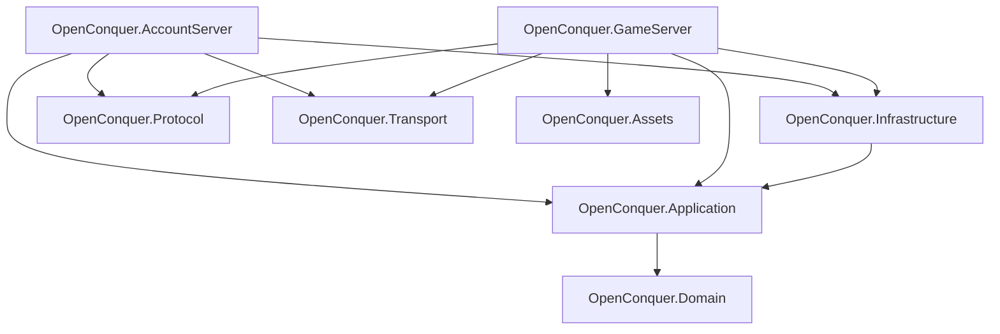

# OpenConquer Server

A server emulator for **Conquer Online 5517**, written in C#/.NET 10

This project is a recreation of the Conquer online MMO server during version 5517.

> **Status:** Early development. The server architecture and foundational runtime systems are
> currently being rebuilt.

## Architecture



The server is split into a small set of focused assemblies:

- **OpenConquer.AccountServer** — login server executable, composition, authentication endpoint, and
  game-server handoff
- **OpenConquer.GameServer** — game server executable, client-session integration, and authoritative
  world hosting
- **OpenConquer.Domain** — game and account models, rules, value objects, and invariants
- **OpenConquer.Application** — use cases, runtime orchestration, world execution, commands, and
  persistence contracts
- **OpenConquer.Infrastructure** — MySQL persistence, database contexts, repositories, and external
  service implementations
- **OpenConquer.Protocol** — Conquer packet formats, codecs, handshakes, legacy cryptography, and
  wire compatibility
- **OpenConquer.Transport** — TCP connections, buffering, backpressure, admission, and connection
  lifetime
- **OpenConquer.Assets** — original client data formats, maps, and static game-content loading

`OpenConquer.Protocol` and `OpenConquer.Transport` are intentionally separate. Protocol owns the
Conquer wire format; Transport owns moving bytes across connections. Neither owns gameplay state.

The authoritative world is implemented through the core game architecture rather than inside network
sessions. GameServer acts as the composition and protocol boundary around that runtime.

More detailed design documentation lives under [`docs/architecture`](docs/architecture).

## Build

```bash
dotnet restore OpenConquer.Server.slnx
dotnet build OpenConquer.Server.slnx -c Release
```

To verify formatting:

```bash
dotnet format OpenConquer.Server.slnx --verify-no-changes
```

## Repository

```text
src/
├── OpenConquer.AccountServer/
├── OpenConquer.Application/
├── OpenConquer.Assets/
├── OpenConquer.Domain/
├── OpenConquer.GameServer/
├── OpenConquer.Infrastructure/
├── OpenConquer.Protocol/
└── OpenConquer.Transport/

tests/
benchmarks/
database/
docs/
tools/
```
