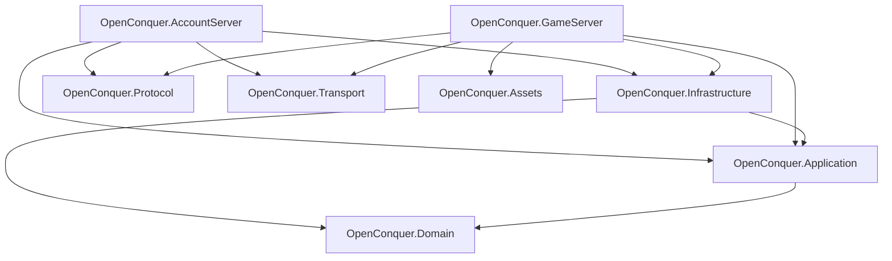

# OpenConquer Server

[](https://github.com/berniemackie97/OpenConquerServer/actions/workflows/ci.yml)

OpenConquer Server is an open-source **Conquer Online 5517** server emulator rebuilt in C# on **.NET 10**.

The project targets accurate 5517 client compatibility while using maintainable, production-grade server architecture.

> **Status:** Early development. Transport, the runnable AccountServer host, the standard 5517 AccountServer login transaction, account authentication, abuse protection, password persistence and migration, account security mutations, durable GameServer login tickets, ticket revocation/redemption, and bounded expired-ticket maintenance are implemented. Account registration, GameServer sessions, and gameplay are not yet implemented.

## Architecture

OpenConquer is a modular monolith with two executable host boundaries.



### Projects

| Project | Responsibility |
| --- | --- |
| **OpenConquer.Domain** | Account rules, state, and invariants. |
| **OpenConquer.Application** | Authentication, account security mutations, and GameServer login-ticket orchestration. |
| **OpenConquer.Infrastructure** | MySQL persistence, password hashing/migration, authentication protection, account mutations, and durable login-ticket persistence. |
| **OpenConquer.Protocol** | 5517 framing, serialization, text encoding, login cryptography, credentials, and packets. |
| **OpenConquer.Transport** | TCP connections, bounded admission, I/O pumps, buffering, and connection lifetime. |
| **OpenConquer.AccountServer** | Runnable 5517 account-login host with readiness-gated startup, bounded login processing, authentication handoff, supervision, observability, and ticket maintenance. |
| **OpenConquer.GameServer** | Host boundary only; game-session and gameplay runtime are not yet implemented. |
| **OpenConquer.Assets** | Asset boundary only; loaders are not yet implemented. |

## Current AccountServer Login Flow

```text
validated host configuration
    ↓
database/schema readiness
    ↓
TCP listener
    ↓
bounded admission
    ↓
fixed login workers
    ↓
LoginConnectionSession
    ↓
1059 login seed
    ↓
1060 standard credential request
    ↓
AccountAuthenticator
    ↓
durable GameLoginTicket grant
    ↓
1055 authentication response
    ↓
1100 MAC report
    ↓
1052 res.dat version report
```

A successful `1055` is not sent until the GameServer login ticket has been durably granted.

The AccountServer supports the standard 5517 `1060` credential path. Protected/mobile login variants are recognized as unsupported and fail closed.

The login listener is not exposed until account database readiness succeeds. Admission and authentication work are bounded, and fatal accept/worker failures terminate the supervised login runtime and request host shutdown.

## Documentation

### Architecture

- [Architecture overview](docs/architecture/README.md)
- [Networking architecture](docs/architecture/networking.md)
- [Authentication and password migration](docs/architecture/authentication.md)
- [World execution](docs/architecture/world-execution.md)
- [Server baseline audit](docs/audits/server-baseline.md)

### Protocol

- [Conquer Online 5517 protocol reference](docs/protocol/README.md)

## Repository Layout

```text
src/
├── OpenConquer.AccountServer/
├── OpenConquer.Application/
├── OpenConquer.Assets/
├── OpenConquer.Domain/
├── OpenConquer.GameServer/
├── OpenConquer.Infrastructure/
├── OpenConquer.Protocol/
└── OpenConquer.Transport/

tests/
├── OpenConquer.AccountServer.Tests/
├── OpenConquer.Application.Tests/
├── OpenConquer.Infrastructure.Tests/
├── OpenConquer.Protocol.Tests/
└── OpenConquer.Transport.Tests/

docs/
├── architecture/
├── audits/
└── protocol/
```

Database schema changes are versioned through EF Core migrations in `OpenConquer.Infrastructure`.

Integration tests provision temporary MySQL 8.4 databases with Testcontainers and apply the repository migrations before exercising persistence code.

## Requirements

- .NET SDK 10.0.400
- Docker for MySQL integration tests

## Build

```bash
dotnet restore OpenConquer.Server.slnx
dotnet build OpenConquer.Server.slnx -c Release --no-restore
```

## Tests

Run the complete suite:

```bash
dotnet test OpenConquer.Server.slnx -c Release --no-build
```

Run the protocol suite:

```bash
dotnet test tests/OpenConquer.Protocol.Tests/OpenConquer.Protocol.Tests.csproj -c Release --no-build
```

Tests use **xUnit v3** on **Microsoft Testing Platform**.

Coverage is available through `coverlet.MTP`:

```bash
dotnet test tests/OpenConquer.Protocol.Tests/OpenConquer.Protocol.Tests.csproj -c Release --no-build --coverlet
```

## Formatting

```bash
dotnet format OpenConquer.Server.slnx --verify-no-changes --no-restore
```

## Continuous Integration

GitHub Actions runs on pull requests targeting `main` and pushes to `main`.

CI verifies:

- locked dependency restore;
- formatting;
- Release build;
- account EF Core model/migration consistency;
- complete test suite;
- pull-request dependency vulnerability review.

Dependabot monitors NuGet packages, the pinned .NET SDK, and GitHub Actions dependencies.

## Disclaimer

OpenConquer Server is an independent open-source project and is not affiliated with or endorsed by the original game publisher or developers.

Conquer Online and related names and assets belong to their respective owners.
