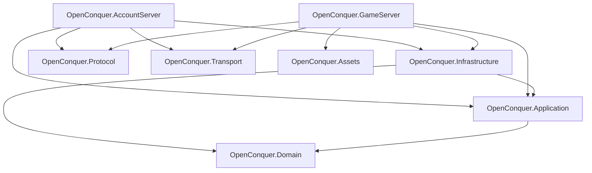

# OpenConquer Server

[](https://github.com/berniemackie97/OpenConquerServer/actions/workflows/ci.yml)

OpenConquer Server is an open source server emulator for **Conquer Online 5517**, rebuilt in C# on
**.NET 10**.

The goal of this project is to have a complete and accurate recreation of the live game servers from
Conquer Online while the client was in version 5517. While faithful parity is the ultimate baseline
goal for the project, the plan is to design it in a way that is easily customizable and extensible.

> **Status:** Early development. The server is being rebuilt from the ground up in focused, fully
> tested implementation slices. The executable entry points are not wired into runnable servers.
> Current code covers transport, login protocol/session components, account authentication, and
> password storage, and a MySQL authentication adapter; it does not yet provide account registration, login tickets,
> or game sessions.

## Architecture

OpenConquer is designed as a modular monolith with two executable hosts and a small set of focused
libraries.



### Projects

The dependency diagram describes project boundaries. Current implementation is:

| Project | Implemented responsibility |
| --- | --- |
| **OpenConquer.Domain** | Account credential invariants. |
| **OpenConquer.Application** | Account authentication orchestration and repository/verifier/attempt-limiter contracts. |
| **OpenConquer.Infrastructure** | PBKDF2 password storage and transparent OpenConquerPublic Identity V3 verification/migration. This branch also implements MySQL authentication lookup and conditional hash replacement. |
| **OpenConquer.Protocol** | Framing, serialization, text encoding, login stream cipher, credentials, and login packets. |
| **OpenConquer.Transport** | TCP listeners/connections, bounded admission, input/output pumps, and connection lifetime. |
| **OpenConquer.AccountServer** | Login session, seed/request handling, and post-authentication report readers. Host composition is not implemented. |
| **OpenConquer.GameServer** | Project boundary only; no game runtime is implemented. |
| **OpenConquer.Assets** | Project boundary only; no asset loaders are implemented. |

## Documentation

Detailed design and compatibility documentation lives under [docs](docs).

### Architecture

- [Architecture overview](docs/architecture/README.md)
- [Networking architecture](docs/architecture/networking.md)
- [World execution](docs/architecture/world-execution.md)
- [Authentication and password migration](docs/architecture/authentication.md)
- [Main re-baseline audit](docs/audits/main-rebaseline.md)
- [Persistence branch reconciliation](docs/audits/account-authentication-persistence.md)

### Protocol

- [Conquer Online 5517 protocol reference](docs/protocol/README.md)

## Repository Layout

```text
src/
├── OpenConquer.AccountServer/
├── OpenConquer.Application/
├── OpenConquer.Assets/
├── OpenConquer.Domain/
├── OpenConquer.GameServer/
├── OpenConquer.Infrastructure/
├── OpenConquer.Protocol/
└── OpenConquer.Transport/

tests/
├── OpenConquer.AccountServer.Tests/
├── OpenConquer.Application.Tests/
├── OpenConquer.Infrastructure.Tests/
├── OpenConquer.Protocol.Tests/
└── OpenConquer.Transport.Tests/

docs/
├── architecture/
├── audits/
└── protocol/
```

There are no tracked database schemas, migrations, benchmark projects, or tool scripts on `main`.
The MySQL adapter targets the existing OpenConquerPublic account schema. Tests provision only
ephemeral container databases; the application does not provision or migrate a live database.

## Requirements

- .NET SDK 10.0.400
- Docker for MySQL integration tests

## Build

Restore dependencies:

```bash
dotnet restore OpenConquer.Server.slnx
```

Build the complete solution:

```bash
dotnet build OpenConquer.Server.slnx -c Release --no-restore
```

## Tests

Run the complete test suite:

```bash
dotnet test OpenConquer.Server.slnx -c Release --no-build
```

Run the protocol suite directly:

```bash
dotnet test tests/OpenConquer.Protocol.Tests/OpenConquer.Protocol.Tests.csproj -c Release --no-build
```

All five test projects use **xUnit v3** on **Microsoft Testing Platform**. Infrastructure tests
exercise real password derivations, migration, and MySQL persistence. Database tests use short-lived
MySQL 8.4 containers through Testcontainers. The ASP.NET Core shared framework is used only by these tests
to independently reproduce the legacy Identity hasher. It is included with the .NET SDK.

Coverage integration is provided through `coverlet.MTP`:

```bash
dotnet test tests/OpenConquer.Protocol.Tests/OpenConquer.Protocol.Tests.csproj -c Release --no-build --coverlet
```

## Formatting

Verify repository formatting without changing files:

```bash
dotnet format OpenConquer.Server.slnx --verify-no-changes --no-restore
```

## Continuous Integration

GitHub Actions validates every pull request targeting `main` and every push to `main`.

The CI pipeline:

- restores dependencies from the committed NuGet lock files
- verifies repository formatting
- builds the complete solution in Release configuration
- runs the complete test suite
- reviews pull-request dependency changes for known vulnerabilities

Dependabot checks NuGet packages, the pinned .NET SDK, and GitHub Actions for updates each week.
GitHub Actions used by CI are pinned to immutable commit SHAs, with Dependabot responsible for
keeping those pins current.

## Disclaimer

OpenConquer Server is an independent open source project and is not affiliated with or endorsed by
the original game publisher or developers. Conquer Online and related names and assets belong to
their respective owners.
