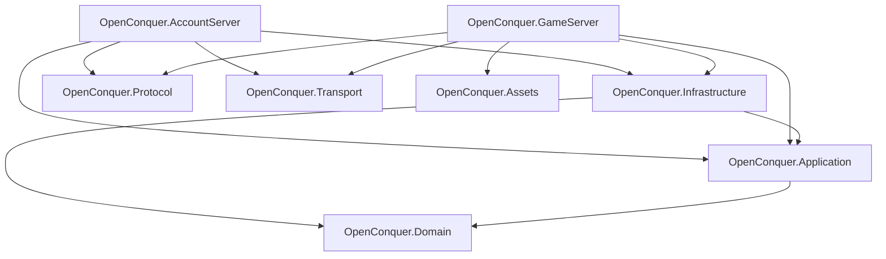

# OpenConquer Server

OpenConquer Server is an open-source server emulator for **Conquer Online 5517**, rebuilt in C# on
**.NET 10**.

The project aims to preserve the behavior and wire compatibility of the 5517 client while replacing
legacy emulator architecture with a clean, testable, server-authoritative runtime designed for
long-term development.

> **Status:** Early development. The server is being rebuilt from the ground up in focused, fully
> tested implementation slices.

## Architecture

OpenConquer is designed as a modular monolith with two executable hosts and a small set of focused
libraries.



An arrow means **depends on**.

### Projects

- **OpenConquer.Domain** contains game and account rules, models, value objects, and invariants.
- **OpenConquer.Application** owns use cases, authoritative world execution, commands,
  orchestration, and infrastructure contracts.
- **OpenConquer.Infrastructure** implements persistence and external dependencies, including the
  account and game database boundaries.
- **OpenConquer.Protocol** owns Conquer packet formats, framing, binary serialization, text
  encoding, handshakes, cryptography, and wire compatibility.
- **OpenConquer.Transport** owns TCP connections, buffering, backpressure, admission, and connection
  lifetime.
- **OpenConquer.Assets** owns original client data formats, maps, and static game-content loading.
- **OpenConquer.AccountServer** is the login-server composition root.
- **OpenConquer.GameServer** is the game-server composition root and integration boundary around the
  authoritative world runtime.

Protocol and transport are intentionally separate.

```text
Protocol  = what the bytes mean
Transport = how the bytes move
```

Neither owns gameplay state.

## Current Foundation

The rebuild currently includes the initial binary protocol foundation:

- 4-byte TQ wire-frame headers
- bounded frame encoding
- caller-owned, allocation-free packet writing
- transactional packet reading
- little-endian primitive serialization
- Windows-1252 and ASCII protocol encodings
- fixed-width and TQ byte-prefixed strings
- caller-supplied frame-size enforcement
- Microsoft Testing Platform-based protocol tests

The generic TQ frame format supports the full 16-bit wire length. Callers can supply tighter
compatibility limits without baking them into generic framing. The future game-session boundary will
supply the **0x400-byte 5517 game-client packet limit** when that protocol slice is implemented.

Transport, handshakes, packet families, authentication, persistence, and the authoritative game
runtime are being added incrementally as their implementation slices are reached.

## Design Principles

The rewrite follows a few core rules:

- preserve observed 5517 protocol and gameplay behavior
- treat the legacy server as evidence, not architecture to copy
- keep protocol, transport, persistence, and gameplay responsibilities separate
- make mutable runtime state explicitly owned
- keep network sessions outside authoritative gameplay state
- bound asynchronous work and memory growth
- avoid unnecessary allocations on hot protocol paths
- fail malformed protocol operations without leaving partially committed state
- prefer measured scalability over premature distributed complexity
- finish and test each implementation slice before building on it

The GameServer world model uses single-owner execution for mutable world partitions. Different
partitions may execute concurrently, but the same partition is never mutated concurrently.

## Documentation

Detailed design and compatibility documentation lives under [`docs`](docs).

### Architecture

- [Architecture overview](docs/architecture/README.md)
- [Networking architecture](docs/architecture/networking.md)
- [World execution](docs/architecture/world-execution.md)

### Protocol

- [Conquer Online 5517 protocol reference](docs/protocol/README.md)

Architecture documentation describes the server's internal boundaries and execution model.

Protocol documentation records externally meaningful 5517 wire behavior and compatibility
requirements.

Documentation distinguishes implemented behavior from architecture or protocol boundaries
established for future implementation.

## Repository Layout

```text
src/
├── OpenConquer.AccountServer/
├── OpenConquer.Application/
├── OpenConquer.Assets/
├── OpenConquer.Domain/
├── OpenConquer.GameServer/
├── OpenConquer.Infrastructure/
├── OpenConquer.Protocol/
└── OpenConquer.Transport/

tests/
└── OpenConquer.Protocol.Tests/

benchmarks/
database/

docs/
├── architecture/
└── protocol/

tools/
```

## Requirements

- .NET SDK 10.0.400

The repository pins its SDK through `global.json`.

## Build

Restore dependencies:

```bash
dotnet restore OpenConquer.Server.slnx
```

Build the complete solution:

```bash
dotnet build OpenConquer.Server.slnx -c Release --no-restore
```

## Tests

Run the complete test suite:

```bash
dotnet test OpenConquer.Server.slnx -c Release --no-build
```

Run the protocol suite directly:

```bash
dotnet test tests/OpenConquer.Protocol.Tests/OpenConquer.Protocol.Tests.csproj \
  -c Release \
  --no-build
```

Protocol tests use **xUnit v3** on **Microsoft Testing Platform**.

Coverage integration is provided through `coverlet.MTP`:

```bash
dotnet test tests/OpenConquer.Protocol.Tests/OpenConquer.Protocol.Tests.csproj \
  -c Release \
  --no-build \
  --coverlet
```

## Formatting

Verify repository formatting without changing files:

```bash
dotnet format OpenConquer.Server.slnx \
  --verify-no-changes \
  --no-restore
```

## Development Approach

OpenConquer is being rebuilt in focused implementation slices.

Each slice is expected to reach a complete boundary before it is committed:

```text
legacy/current evidence
        ↓
final boundary design
        ↓
implementation
        ↓
audit and polish
        ↓
tests and verification
        ↓
documentation
        ↓
commit
```

Known defects, unfinished cleanup, and intentionally deferred fixes are not considered a finished
slice.

## Project Status

OpenConquer Server is not currently a complete playable server.

The repository is under active reconstruction toward Conquer Online 5517 compatibility, with
foundational systems being completed and verified before higher-level gameplay systems are built on
top of them.

## Disclaimer

OpenConquer Server is an independent open-source project and is not affiliated with or endorsed by
the original game publisher or developers. Conquer Online and related names and assets belong to
their respective owners.
