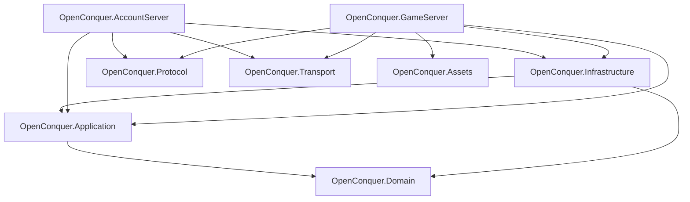
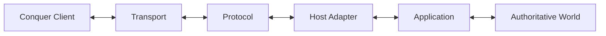
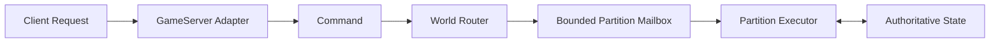

# Architecture

OpenConquer Server is a modular monolith built around explicit ownership, bounded work, server
authoritative gameplay, and strict separation between wire protocol, network transport, persistence,
and the live world.

## Solution Structure



## Projects

### OpenConquer.Domain

Owns game and account rules, models, value objects, and invariants.

Domain does not depend on:

- Application
- Infrastructure
- Protocol
- Transport
- hosting
- persistence frameworks

### OpenConquer.Application

Owns application behavior around the domain.

Its boundary includes:

- use cases
- infrastructure contracts
- authoritative world execution
- commands and events
- routing
- scheduling
- cross-system orchestration

Application depends inward on Domain and does not depend on Infrastructure.

### OpenConquer.Infrastructure

Implements external dependencies required by Application.

Its scope includes:

- MySQL persistence
- EF Core contexts and mappings
- repositories
- migrations
- external-service adapters
- infrastructure security implementations

Account and game persistence remain distinct ownership boundaries even while sharing one assembly.

### OpenConquer.Protocol

Owns the Conquer Online wire contract:

- packet identifiers
- packet layouts
- framing
- binary serialization
- text encodings
- handshakes
- protocol cryptography
- client compatibility behavior

Protocol does not own sockets, connection lifetime, persistence, or gameplay state.

See the [5517 Protocol Reference](../protocol/README.md).

### OpenConquer.Transport

Owns network mechanics:

- TCP listeners
- sockets and connection lifetime
- asynchronous I/O
- buffering
- ordering
- bounded output
- backpressure
- admission
- transport resource limits

Transport operates on bytes without interpreting Conquer packet semantics.

See [Networking Architecture](networking.md).

### OpenConquer.Assets

Owns static client-derived data such as:

- DMap data
- map metadata
- static content formats
- client-derived lookup data

Asset parsing is separate from network protocol parsing.

### OpenConquer.AccountServer

The login-server executable and composition root.

It composes the services required for:

- login transport
- login protocol
- authentication
- account persistence
- GameServer handoff

Business rules and infrastructure implementation details do not belong in the host itself.

### OpenConquer.GameServer

The game-server executable and composition root.

Its integration path is:

```text
Transport
    ↓
Protocol
    ↓
GameServer adapters
    ↓
Application
    ↓
Authoritative world
```

Network sessions do not own gameplay state.

## Dependency Rules

The core dependency direction is:

```text
Domain
  ↑
Application
  ↑
Infrastructure
```

Additional rules:

```text
Protocol     does not depend on Transport or gameplay layers
Transport    does not depend on Protocol or gameplay layers
Domain       does not depend on Application or Infrastructure
Application  does not depend on Infrastructure
Hosts        are composition roots
Assets       does not own live gameplay state
```

A new assembly should only be introduced when it creates a meaningful:

- dependency boundary
- ownership boundary
- deployment boundary
- provider boundary
- reuse boundary

Subsystem importance alone does not justify another project.

## Protocol and Transport

Protocol and Transport are intentionally independent.

```text
Protocol
"What do these bytes mean?"

Transport
"How do these bytes move?"
```

The runtime relationship is:



Transport must not know packet identifiers, frame compatibility limits, authentication semantics, or
gameplay meaning.

Protocol must not own sockets, connection lifetime, transport queues, or backpressure.

Detailed boundaries:

- [Networking Architecture](networking.md)
- [Protocol Reference](../protocol/README.md)
- [TQ Framing](../protocol/framing.md)
- [TQ Text Encoding](../protocol/encoding.md)

## Authoritative World

Clients submit requests.

They do not directly mutate gameplay state.



Mutable world state has one authoritative execution owner at a time.

Different partitions may execute concurrently.

The same partition may not execute concurrent mutation turns.

See [World Execution](world-execution.md).

## Persistence

The database is durable storage, not the live world.

```text
database
    ↕
Infrastructure
    ↕
Application
    ↕
authoritative runtime
```

Online gameplay objects are not long-lived EF Core tracked entities.

Long-running `DbContext` instances do not own active world state.

External persistence latency must not hold world execution open.

## Resource Ownership

Resources must have visible owners.

Examples:

| Resource                | Owner                            |
| ----------------------- | -------------------------------- |
| TCP socket              | Transport connection             |
| Transport buffers       | Transport                        |
| Frame memory            | Caller / transport boundary      |
| `PacketWriter`          | Borrows caller memory            |
| `DbContext`             | Bounded infrastructure operation |
| Mutable partition state | World partition                  |
| Gameplay entity state   | Authoritative runtime owner      |

Borrowed resources must not outlive their owner's validity boundary.

## Bounded Work

Asynchronous work must not grow without control.

This applies to:

- accepted connections
- transport input/output
- world partition mailboxes
- persistence work
- scheduled world work
- replication work
- other producer/consumer boundaries

A bounded queue still requires a deliberate overflow policy.

Depending on semantics, that may involve:

```text
backpressure
rejection
disconnect
coalescing
replacement
controlled shedding
```

Unbounded accumulation is not the default scalability strategy.

## Failure Boundaries

Subsystems should fail without leaving misleading partially committed state where practical.

The current Protocol foundation already establishes examples:

```text
PacketReader field failure
    -> cursor unchanged

PacketWriter validation/capacity failure
    -> committed position unchanged

WireFrameEncoder serialization failure
    -> attempted frame cleared
```

Equivalent explicit failure boundaries should be maintained as networking, persistence,
authentication, and gameplay systems are implemented.

## Time and Determinism

Simulation durations should use monotonic time.

Calendar behavior should use wall-clock time.

Authoritative randomness should use an explicit controllable abstraction when deterministic testing
matters.

These boundaries improve reproducibility and prevent system-clock behavior from leaking into
simulation logic.

## Scaling Strategy

The initial deployment model is a modular monolith.

A GameServer process may host many independently owned world partitions:

```text
GameServer
├── WorldPartition A
├── WorldPartition B
├── WorldPartition C
└── WorldPartition D
```

Different partitions may execute on different .NET worker threads while preserving exclusive
mutation inside each partition.

The architecture does not require distributed world processes, message brokers, or one process per
map.

Those boundaries should only be introduced when measured capacity or deployment requirements justify
them.

## Documentation

### Architecture

- [Networking Architecture](networking.md)
- [World Execution](world-execution.md)

### Protocol

- [Protocol Reference](../protocol/README.md)
- [TQ Framing](../protocol/framing.md)
- [TQ Text Encoding](../protocol/encoding.md)

Architecture documents explain **how the server is structured**.

Protocol documents explain **what the 5517 client expects on the wire**.

Both should evolve with implementation so the repository remains an accurate description of the
system rather than an aspirational design that has drifted away from the code.
