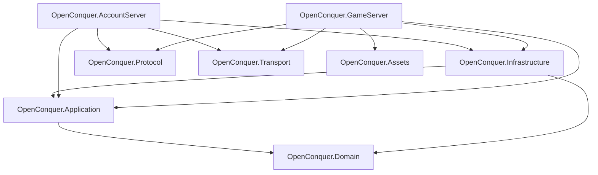
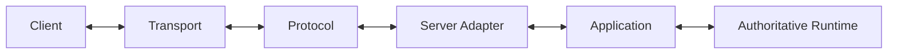
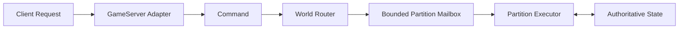

# Architecture

OpenConquer Server is a modular monolith built around explicit ownership, bounded work, strict
dependency direction, and server-authoritative state.

## Solution Structure



## Projects

| Project                      | Responsibility                                                                                                                   |
| ---------------------------- | -------------------------------------------------------------------------------------------------------------------------------- |
| `OpenConquer.Domain`         | Domain rules, state, value objects, and invariants.                                                                              |
| `OpenConquer.Application`    | Use cases, orchestration, authorization, and persistence contracts.                                                              |
| `OpenConquer.Infrastructure` | MySQL persistence, EF Core mappings, password storage, security infrastructure, and external adapters.                           |
| `OpenConquer.Protocol`       | Packet layouts, framing, serialization, text encoding, protocol cryptography, and client compatibility.                          |
| `OpenConquer.Transport`      | TCP, connections, buffering, asynchronous I/O, admission, backpressure, and connection lifetime.                                 |
| `OpenConquer.Assets`         | Static client-derived data and asset formats.                                                                                    |
| `OpenConquer.AccountServer`  | Runnable 5517 account-login host and authentication-handshake orchestration.                                                     |
| `OpenConquer.GameServer`     | GameServer connection handoff, character-login routing, native compatibility-channel orchestration, and future gameplay hosting. |

## Dependency Rules

Core direction:

```text
Domain
  ↑
Application
  ↑
Infrastructure
```

Additional rules:

```text
Domain
    does not depend on Application, Infrastructure, Protocol, Transport, or hosts

Application
    depends on Domain
    does not depend on Infrastructure

Protocol
    does not depend on Transport, Application, gameplay, persistence, or hosts

Transport
    does not depend on Protocol, Application, gameplay, or persistence

Hosts
    compose concrete implementations and protocol/transport adapters

Assets
    does not own mutable live-world state
```

A new assembly requires a real dependency, ownership, deployment, provider, or reuse boundary.

## Protocol and Transport

```text
Protocol
    interprets and produces Conquer wire data

Transport
    moves bytes and owns network resources
```

Runtime flow:



Transport must not know packet semantics.

Protocol must not own sockets, connection lifetime, transport queues, or backpressure.

See [Networking Architecture](networking.md).

## AccountServer

The standard 5517 AccountServer transaction is implemented:

```text
TCP connection
    ↓
per-source connection admission
    ↓
bounded global admission
    ↓
LoginConnectionSession
    ↓
1059 seed
    ↓
1060 credentials
    ↓
AccountAuthenticator
    ↓
durable GameLoginTicket grant
    ↓
1055 handoff
    ↓
1100 MAC report
    ↓
1052 res.dat report
```

Ownership is split by boundary:

| Boundary                         | Owner                            |
| -------------------------------- | -------------------------------- |
| TCP and generic admission        | Transport                        |
| Per-source admission policy      | Infrastructure                   |
| Login runtime orchestration      | AccountServer                    |
| 5517 wire behavior               | Protocol / AccountServer adapter |
| Authentication and ticket rules  | Application                      |
| Persistence and abuse protection | Infrastructure                   |

### Host Lifecycle

The AccountServer is a runnable Generic Host.

Startup is ordered:

```text
load and validate configuration
    ↓
compose services
    ↓
verify account database/schema readiness
    ↓
start expired-ticket maintenance
    ↓
create TCP listener
    ↓
start bounded login runtime
```

The TCP listener is created only after database readiness succeeds.

Login ingress is bounded by:

```text
kernel backlog
    ↓
TCP accept
    ↓
per-source connection admission
    ↓
bounded global admission queue
    ↓
fixed worker pool
    ↓
bounded authentication protection
    ↓
database
```

Capacity exhaustion rejects connections instead of growing unbounded work.

Fatal listener or worker failure faults the supervised login runtime and triggers graceful host
shutdown. Fatal background-service failure results in a nonzero process exit code.

Shutdown stops login ingress before maintenance and disposes queued connections through explicit
ownership.

Expired-ticket cleanup is bounded maintenance. It does not determine ticket authorization.

See:

- [Networking Architecture](networking.md)
- [Authentication](authentication.md)

## GameServer Connection Handoff

The GameServer connection handoff is implemented through authenticated application-session ownership
over the native 5517 encrypted compatibility channel.

```text
accepted transport
    ↓
GameConnectionSession
    ↓
native Diffie-Hellman exchange
    ↓
CAST5 encrypted framing
    ↓
1052 login proof
    ↓
GameLoginTicketRedeemer
    ↓
AuthenticatedGameConnection
    ↓
CharacterLoginHandoffProcessor
    ↓
CharacterCreation | ExistingCharacter
```

The connection session owns transport pumps, pipelines, handshake state, encrypted framing, cipher
state, cancellation, and disposal.

The transport byte stream remains continuous across the handshake-to-encrypted transition so
fragmented and coalesced input is handled without discarding already-buffered data.

The native GameServer channel preserves stock 5517 compatibility. It is not modern authenticated
transport and does not authenticate server endpoint identity.

Application identity is established separately through successful single-use ticket redemption. The
live session transfers to `AuthenticatedGameConnection` only after authorization succeeds.

After authentication, `CharacterLoginHandoffProcessor` resolves the canonical account ID through the
application character-login boundary. An account without a persisted character routes to character
creation. An account with a persisted character receives the validated login profile required by the
future existing-character bootstrap path.

The same authenticated connection remains continuously owned through character-login resolution.
Successful resolution transfers that exact connection with its resolved route. Resolution failure,
cancellation, or invalid persisted identity closes the owned connection instead of exposing a
partially resolved session.

Secured GameServer output permits one active frame writer per connection. Overlapping writes are
rejected immediately rather than queued.

The runnable GameServer host, connection admission runtime, character creation transaction,
existing-character bootstrap, gameplay routing, and authoritative world integration remain future
boundaries.

See:

- [Networking Architecture](networking.md)
- [Authentication](authentication.md)

## Authoritative World

Clients submit requests; they do not directly mutate gameplay state.

Planned world execution:



A world partition has one mutation owner at a time.

Different partitions may execute concurrently. The same partition may not execute concurrent
mutation turns.

See [World Execution](world-execution.md).

## Persistence

The database is durable storage, not live gameplay state.

```text
database
    ↕
Infrastructure
    ↕
Application
    ↕
authoritative runtime
```

Accounts and Game persistence are separate durable boundaries.

Accounts persistence owns account identity, credentials, security state, and game-login tickets.

Game persistence owns character-login state. The initial Game schema provides:

- one persisted character per account;
- unique character names;
- player entity IDs beginning at `1,000,000`;
- appearance and hair state;
- level, experience, profession, and rebirth state;
- attributes, current life, and current mana;
- silver, Conquer Points, and bound Conquer Points;
- PK points, title, and enlightenment points;
- persisted map ID and position.

The Game database does not establish a cross-database foreign key to Accounts. Successful single-use
ticket redemption establishes the trusted authenticated account identity used for character
resolution.

Game character-login reads use bounded `DbContext` operations and produce validated application
models rather than exposing persistence records to the GameServer boundary.

Long-running `DbContext` instances do not own active world state.

Persistence latency must not hold authoritative world execution open.

## Resource Ownership

| Resource                | Owner                                                                  |
| ----------------------- | ---------------------------------------------------------------------- |
| TCP listener            | Host runtime                                                           |
| Accepted connection     | Transport / admission / connection session according to transfer state |
| Transport buffers       | Transport                                                              |
| Login session           | AccountServer connection scope                                         |
| Game connection session | GameServer connection scope                                            |
| Protocol frame memory   | Owning caller/session boundary                                         |
| `DbContext`             | Bounded infrastructure operation                                       |
| Durable transaction     | Infrastructure operation                                               |
| Mutable world partition | Partition executor                                                     |

Borrowed memory must not outlive its owner.

Ownership transfers must be explicit, including failure paths.

## Bounded Work

Potentially unbounded producer/consumer boundaries require explicit capacity and overload behavior.

Examples:

- accepted connections;
- authentication work;
- transport I/O;
- maintenance batches;
- gameplay outbound work;
- world partition commands;
- scheduled world work;
- persistence work;
- replication work.

Allowed overload strategies depend on semantics:

```text
backpressure
rejection
disconnect
coalescing
replacement
controlled shedding
```

Unbounded accumulation is not an acceptable default.

## Failure Boundaries

Failures must not expose misleading partial state.

Current examples:

```text
PacketReader failure
    -> cursor remains valid

PacketWriter validation/capacity failure
    -> committed position unchanged

WireFrameEncoder failure
    -> attempted frame region cleared

game-login ticket grant
    -> success returned only after durable commit

game-login ticket redemption
    -> authorization succeeds only after durable single-use consumption

account security mutation
    -> required ticket revocation commits transactionally

AccountServer database readiness failure
    -> listener is never exposed

AccountServer runtime failure
    -> sibling runtime work is stopped and host shutdown is requested

AccountServer fatal background-service failure
    -> host shuts down and returns a nonzero process exit code

GameServer connection handoff failure
    -> owned session is closed instead of exposing partial authentication state

GameServer character-login resolution failure
    -> owned authenticated connection is closed instead of exposing partial character state

GameServer overlapping secured write
    -> rejected immediately instead of queued
```

Ambiguous durable commit outcomes are not blindly retried.

## Time

Use the correct authority for each responsibility:

```text
simulation duration / scheduling
    -> monotonic time

durable ticket issue / expiration
    -> MySQL wall clock

maintenance cadence
    -> injected process time

calendar or persisted wall-clock events
    -> explicit wall-clock authority
```

Process time does not decide durable game-login ticket validity.

## Scaling Model

Initial deployment is a modular monolith.

The AccountServer contains no irreplaceable live player state and is designed to remain restartable.

Future GameServer processes may host multiple independently owned world partitions:

```text
GameServer
├── Partition A
├── Partition B
├── Partition C
└── Partition D
```

Distributed services or message brokers should be introduced only when measured deployment or
capacity requirements justify them.

## Current Runtime Status

Implemented:

- shared framing and serialization;
- TCP transport foundation;
- bounded global connection admission;
- per-source AccountServer pre-authentication admission;
- AccountServer login session and stream cryptography;
- standard 5517 AccountServer authentication transaction;
- fixed login worker pool and whole-connection timeout;
- bounded authentication abuse protection;
- durable GameServer login-ticket grant/redemption;
- transactional ticket revocation;
- database-readiness startup gating;
- delayed AccountServer listener creation;
- supervised AccountServer runtime lifecycle;
- fatal AccountServer background-service exit propagation;
- login runtime metrics;
- bounded expired-ticket maintenance;
- runnable AccountServer composition root;
- strict AccountServer deployment configuration;
- GameServer connection/session ownership;
- native GameServer Diffie-Hellman exchange and CAST5 compatibility encryption;
- GameServer encrypted framing;
- single-owner GameServer secured outbound writes;
- GameServer `1052` login-proof authentication;
- authenticated GameServer connection handoff;
- Game character persistence and schema-readiness verification;
- persisted character-login profile resolution;
- authenticated account routing to character creation or existing-character login;
- ownership-safe post-authentication character-login handoff;
- MySQL account persistence;
- MySQL Game character-login persistence.

Not yet implemented:

- account registration;
- runnable GameServer Generic Host;
- GameServer listener, admission queue, and worker runtime;
- gameplay outbound scheduling and bounded mailbox policy;
- existing-character bootstrap packet sequence and map entry;
- character creation request processing and durable creation;
- authoritative world simulation;
- gameplay networking and simulation.

## Documentation

- [Networking Architecture](networking.md)
- [Authentication](authentication.md)
- [World Execution](world-execution.md)
- [Protocol Reference](../protocol/README.md)
- [TQ Framing](../protocol/framing.md)
- [TQ Text Encoding](../protocol/encoding.md)

Architecture documents describe ownership and runtime boundaries.

Protocol documents describe client-visible 5517 wire behavior.
