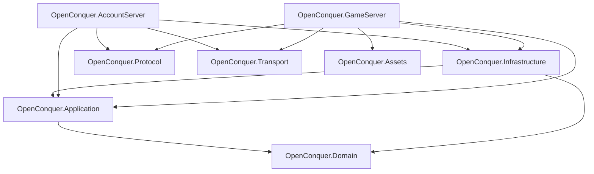
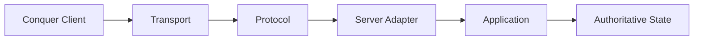
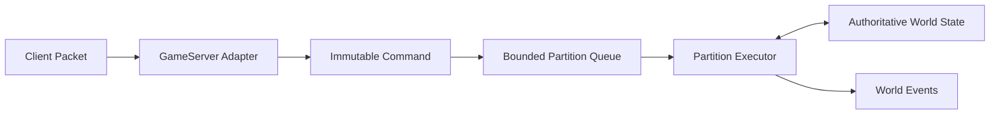
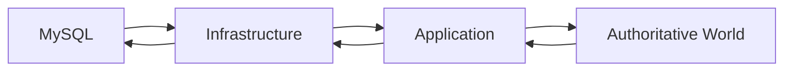

# Architecture

OpenConquer Server is built as a modular monolith with two executable hosts and a small set of
focused libraries.

The architecture is designed around server-authoritative gameplay, explicit ownership of mutable
world state, bounded asynchronous work, and strict separation between gameplay, persistence,
protocol, and network transport.

## Solution Structure



An arrow means **depends on**.

## Core Layers

### Domain

`OpenConquer.Domain` contains the rules and state that define the game and account model.

It owns:

- entities and value objects
- game rules and invariants
- character and account state
- items, combat, skills, NPCs, social systems, and world concepts
- pure domain state transitions

It does not depend on persistence, networking, hosting, or protocol code.

### Application

`OpenConquer.Application` coordinates the running server around the domain.

It owns:

- application use cases
- persistence and external-service contracts
- authoritative world execution
- world commands and events
- partition scheduling and routing
- cross-system orchestration

The world runtime uses explicit state ownership rather than allowing network sessions or background
tasks to mutate shared world state directly.

### Infrastructure

`OpenConquer.Infrastructure` implements external dependencies required by the application.

It owns:

- MySQL persistence
- `AccountDbContext`
- `GameDbContext`
- repository implementations
- database mappings and migrations
- infrastructure-level security and external-service adapters

Infrastructure depends inward on Application and Domain. Neither core layer depends on
Infrastructure.

## Networking

Networking is deliberately split between transport and protocol.



### Transport

`OpenConquer.Transport` owns connection mechanics:

- TCP sockets
- listeners
- buffering
- connection lifetime
- backpressure
- admission and resource limits

It operates on bytes and does not know about Conquer packets or gameplay.

### Protocol

`OpenConquer.Protocol` owns the Conquer wire contract:

- packet identifiers and layouts
- framing rules
- encoding and decoding
- login and game handshakes
- legacy cryptography
- client compatibility behavior

It does not own sockets, persistence, or gameplay state.

## Executable Hosts

### AccountServer

`OpenConquer.AccountServer` is the login-server composition root.

It connects transport and protocol handling to account authentication and game-server handoff while
keeping authentication rules and persistence outside the executable itself.

### GameServer

`OpenConquer.GameServer` is the game-server composition root.

It accepts authenticated clients, translates protocol messages into application commands, hosts the
authoritative world runtime, and translates resulting events back into protocol messages.

Gameplay state does not belong to network sessions.

## World Execution

Mutable world state has one authoritative execution owner at a time.

The initial ownership boundary is a map instance or another deliberately chosen world partition.



A partition may execute on different .NET worker threads over time, but two mutation turns for the
same partition must never execute concurrently.

This keeps nearby gameplay local while avoiding pervasive locking around shared player, map, combat,
and visibility state.

## Persistence

The database is durable storage, not the live world.



Online world objects are not EF Core tracked entities and do not retain long-lived `DbContext`
instances.

Account and game persistence use separate database contexts and ownership boundaries inside
`OpenConquer.Infrastructure`.

## Architectural Rules

The core dependency direction is:

```text
Domain
  ↑
Application
  ↑
Infrastructure
```

Additionally:

```text
Protocol     does not depend on Transport or gameplay layers
Transport    does not depend on Protocol or gameplay layers
Domain       does not depend on Application or Infrastructure
Application  does not depend on Infrastructure
Hosts        are composition roots
```

A new assembly should only be introduced when it creates a meaningful dependency, ownership,
deployment, or reuse boundary.

Conceptual modules such as World, Characters, Combat, and Items do not require separate assemblies
simply because they are important subsystems.
