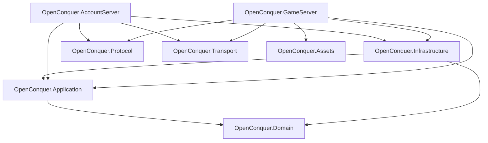
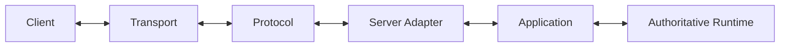
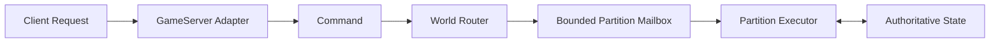

# Architecture

OpenConquer Server is a modular monolith built around explicit ownership, bounded work, strict
dependency direction, and server-authoritative state.

## Solution Structure



## Projects

| Project                      | Responsibility                                                                                                       |
| ---------------------------- | -------------------------------------------------------------------------------------------------------------------- |
| `OpenConquer.Domain`         | Domain rules, state, value objects, and invariants.                                                                  |
| `OpenConquer.Application`    | Use cases, orchestration, commands, scheduling contracts, persistence contracts, and authoritative runtime behavior. |
| `OpenConquer.Infrastructure` | MySQL persistence, EF Core mappings/migrations, password storage, security infrastructure, and external adapters.    |
| `OpenConquer.Protocol`       | Packet layouts, framing, serialization, text encoding, protocol cryptography, and client compatibility.              |
| `OpenConquer.Transport`      | TCP, connections, buffering, asynchronous I/O, admission, backpressure, and connection lifetime.                     |
| `OpenConquer.Assets`         | Static client-derived data and asset formats.                                                                        |
| `OpenConquer.AccountServer`  | Account-login protocol integration and standard 5517 authentication-handshake orchestration.                         |
| `OpenConquer.GameServer`     | GameServer composition boundary. Runtime game sessions are not yet implemented.                                      |

## Dependency Rules

Core direction:

```text
Domain
  ↑
Application
  ↑
Infrastructure
```

Additional rules:

```text
Domain
    does not depend on Application, Infrastructure, Protocol, Transport, or hosts

Application
    depends on Domain
    does not depend on Infrastructure

Protocol
    does not depend on Transport, Application, Domain gameplay, persistence, or hosts

Transport
    does not depend on Protocol, Application, gameplay, or persistence

Hosts
    compose concrete implementations and protocol/transport adapters

Assets
    does not own mutable live-world state
```

A new assembly requires a real dependency, ownership, deployment, provider, or reuse boundary.

Subsystem size alone is not sufficient reason to create another project.

## Protocol and Transport

The boundary is explicit:

```text
Protocol
    interprets and produces Conquer wire data

Transport
    moves bytes and owns network resources
```

Runtime flow:



Transport must not know packet semantics.

Protocol must not own sockets, connection lifetime, transport queues, or backpressure.

See:

- [Networking Architecture](networking.md)
- [Protocol Reference](../protocol/README.md)

## AccountServer Login Boundary

The standard 5517 AccountServer transaction is implemented:

```text
TCP connection
    ↓
LoginConnectionSession
    ↓
1059 seed
    ↓
1060 credentials
    ↓
AccountAuthenticator
    ↓
durable GameLoginTicket grant
    ↓
1055 handoff
    ↓
1100 MAC report
    ↓
1052 res.dat report
```

`OpenConquer.AccountServer` owns orchestration of this transaction.

Application owns authentication and ticket issuance rules.

Infrastructure owns durable persistence and abuse-protection implementations.

Protocol owns packet and cryptographic wire behavior.

Transport owns connection and byte movement.

The executable AccountServer composition root, listener, connection admission, and worker lifecycle
are not yet wired.

See [Authentication](authentication.md).

## Authoritative World

Clients submit requests; they do not directly mutate gameplay state.

Planned world execution:



A world partition has one mutation owner at a time.

Different partitions may execute concurrently.

The same partition may not execute concurrent mutation turns.

See [World Execution](world-execution.md).

## Persistence

The database is durable storage, not live gameplay state.

```text
database
    ↕
Infrastructure
    ↕
Application
    ↕
authoritative runtime
```

Long-running `DbContext` instances do not own active world state.

Persistence latency must not hold authoritative world execution open.

## Resource Ownership

Resources require explicit owners.

| Resource                | Owner                            |
| ----------------------- | -------------------------------- |
| TCP socket              | Transport connection             |
| Transport buffers       | Transport                        |
| Login session           | AccountServer connection scope   |
| Protocol frame memory   | Owning caller/session boundary   |
| `DbContext`             | Bounded infrastructure operation |
| Durable transaction     | Infrastructure operation         |
| Mutable world partition | Partition executor               |

Borrowed memory must not outlive its owner.

## Bounded Work

Potentially unbounded producer/consumer boundaries require explicit capacity and overload behavior.

Examples:

- accepted connections;
- authentication work;
- transport I/O;
- world partition commands;
- scheduled world work;
- persistence work;
- replication work.

Allowed overload strategies depend on semantics:

```text
backpressure
rejection
disconnect
coalescing
replacement
controlled shedding
```

Unbounded accumulation is not an acceptable default.

## Failure Boundaries

Operations should not expose misleading partial state.

Current examples include:

```text
PacketReader failure
    -> cursor remains valid

PacketWriter validation/capacity failure
    -> committed position unchanged

WireFrameEncoder failure
    -> attempted frame region cleared

game-login ticket grant
    -> success returned only after durable commit

account security mutation
    -> ticket revocation committed transactionally when required
```

Ambiguous durable commit outcomes are not blindly retried.

## Time

Use the correct time authority for each responsibility:

```text
simulation duration / scheduling
    -> monotonic time

durable ticket issue / expiration timestamps
    -> MySQL wall clock

calendar or persisted wall-clock events
    -> explicit wall-clock authority
```

Do not use process wall-clock time where durable database ordering is authoritative.

## Scaling Model

Initial deployment is a modular monolith.

A GameServer process may host multiple independently owned world partitions:

```text
GameServer
├── Partition A
├── Partition B
├── Partition C
└── Partition D
```

Distributed world services or message brokers are not required by the architecture.

They should be introduced only when measured capacity or deployment requirements justify them.

## Current Runtime Status

Implemented:

- shared framing and serialization;
- transport connection foundation;
- AccountServer login session;
- standard 5517 AccountServer authentication transaction;
- account authentication;
- bounded authentication abuse protection;
- durable GameServer login-ticket grant/redemption;
- transactional ticket revocation for authentication-invalidating account mutations;
- MySQL account persistence.

Not yet implemented:

- production AccountServer composition and listener lifecycle;
- account registration;
- GameServer handshake/session;
- GameServer login proof;
- character bootstrap;
- world simulation;
- gameplay.

## Documentation

- [Networking Architecture](networking.md)
- [World Execution](world-execution.md)
- [Authentication](authentication.md)
- [Protocol Reference](../protocol/README.md)
- [TQ Framing](../protocol/framing.md)
- [TQ Text Encoding](../protocol/encoding.md)

Architecture documents describe server ownership and dependency boundaries.

Protocol documents describe client-visible 5517 wire behavior.
