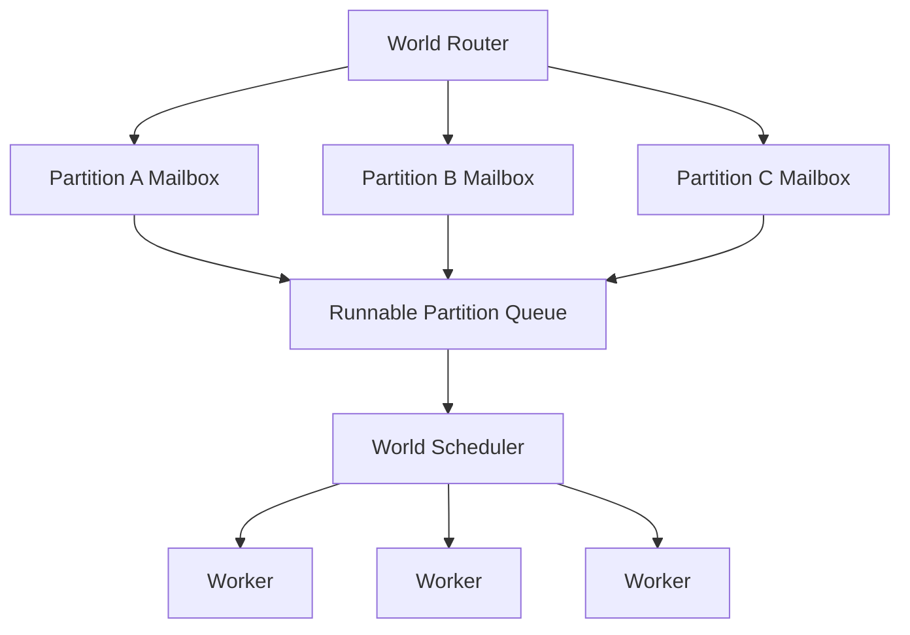
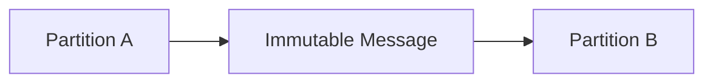
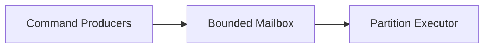
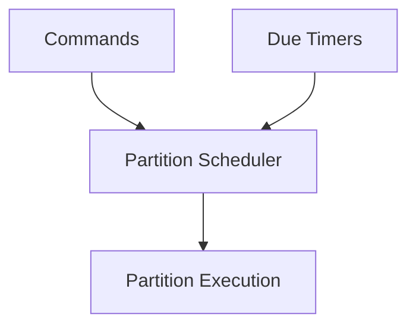
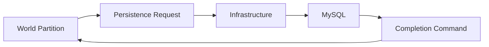
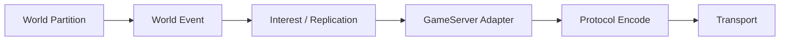
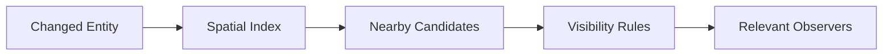
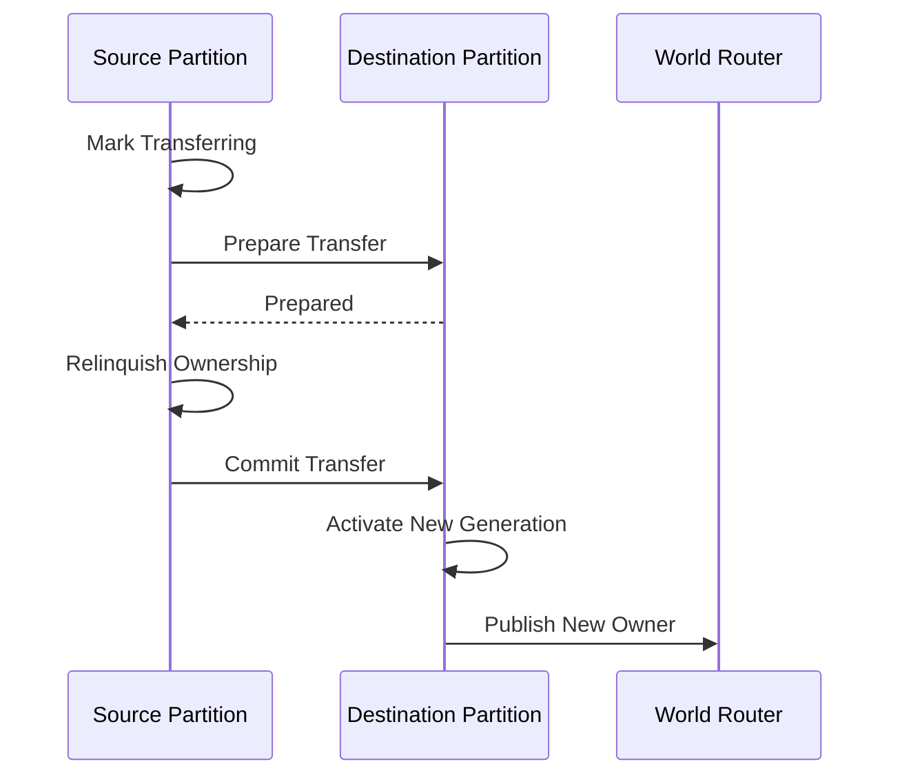

# World Execution

OpenConquer uses a server authoritative world model with explicit ownership of mutable runtime
state.

The core rule is:

> **Every mutable runtime aggregate has one authoritative owner at any point in time.**

For spatial gameplay, that owner is a `WorldPartition`.

Network connections, persistence workers, timers, and unrelated partitions do not directly mutate
partition owned state.

## World Partitions

A `WorldPartition` is the unit of authoritative world execution.

A partition is not permanently defined as a map. The initial placement policy assigns one map
instance to one partition because maps are the natural locality boundary for Conquer gameplay.

```text
WorldPartition
└── MapInstance
    ├── Players
    ├── Monsters
    ├── NPCs
    ├── Ground items
    ├── Portals
    ├── Combat state
    ├── Visibility state
    └── Timers
```

This distinction leaves room for future placement policies without changing the ownership model.

Small maps could eventually share a partition. A particularly expensive workload could receive
dedicated execution resources.

Splitting a single map across multiple authoritative partitions is not part of the initial design.
That adds significant complexity to movement, combat, visibility, AI, and boundary interactions and
should only be considered if profiling demonstrates a real need.

## Execution Model

A partition does not own a dedicated operating system thread.

Partitions execute through a shared scheduler using normal .NET worker threads.



Different partitions may execute concurrently.

The same partition may not execute two mutation turns concurrently.

```text
Partition A + Partition B = allowed concurrently

Partition A + Partition A = never allowed concurrently
```

The runtime must preserve:

```text
ConcurrentMutationTurns(partition) <= 1
```

This is logical ownership, not thread affinity. A partition may execute on different worker threads
over its lifetime.

## Cooperative Scheduling

A busy partition must not monopolize execution resources.

Each scheduled partition receives a bounded execution turn.

A turn may process work until a configured command count, execution time budget, or another measured
scheduling limit is reached.

```text
Runnable
   ↓
Claim exclusive execution
   ↓
Process bounded work
   ↓
Work remaining?
   ├── Yes -> requeue
   └── No  -> idle
```

The exact execution quantum is a runtime tuning value and will be established through benchmarks and
load testing.

It is not an architectural constant.

A partition must only appear once in the runnable queue while it is already queued or executing.

## Command Flow

Client packets represent requests.

They do not directly change world state.

```mermaid
flowchart LR
    Client["Client"]
    Transport["Transport"]
    Protocol["Protocol"]
    Adapter["GameServer Adapter"]
    Command["World Command"]
    Router["World Router"]
    Mailbox["Bounded Mailbox"]
    Executor["Partition Executor"]
    State["Authoritative State"]

    Client --> Transport
    Transport --> Protocol
    Protocol --> Adapter
    Adapter --> Command
    Command --> Router
    Router --> Mailbox
    Mailbox --> Executor
    Executor <--> State
```



Typical commands include:

```text
MoveCharacter
JumpCharacter
AttackEntity
UseItem
EquipItem
InteractWithNpc
EnterPortal
```

Commands contain identifiers and values needed to express intent.

They do not contain mutable `GameSession` references, EF Core entities, `DbContext` instances, or
direct references to state owned by another partition.

The partition resolves the authoritative entity and decides whether the requested action is valid.

## Server Authority

The client is not trusted as the source of consequential game state.

A movement packet means:

```text
Request this movement.
```

It does not mean:

```text
Set the character position to this value.
```

Movement validation can use:

- current authoritative position
- map bounds
- passability
- movement rules
- character state
- elapsed simulation time
- active restrictions or abilities

The same rule applies to combat, inventory, equipment, trading, NPC interaction, and other gameplay
systems.

The client requests an action. The server determines the result.

## Partition Owned State

A world partition owns mutable spatial state associated with the gameplay it executes.

Typical partition owned state includes:

```text
Characters
Monsters
NPC runtime state
Ground items
Movement
Combat
Visibility indexes
Status effects
Respawns
Map timers
Map events
```

Ordinary mutable collections can be used inside the partition because ownership prevents concurrent
mutation.

Code outside the partition must not obtain these objects and modify them directly.

Cross partition communication uses immutable commands, messages, identifiers, or snapshots.



Thread safe collections are still appropriate for infrastructure such as routing tables when needed,
but they are not a replacement for authoritative ownership.

## Non Spatial State

Not all server state belongs to a world partition.

Systems such as these may require different ownership boundaries:

```text
Guilds
Realm presence
Global chat
Rankings
Account state
Cross map services
```

The general rule remains the same:

> **Mutable state must have an explicit authoritative owner.**

A world partition is the default owner for spatial gameplay. It is not the universal owner for every
subsystem in the server.

## Ordering

Ordering guarantees are local.

### Connection Input

TCP provides an ordered byte stream for one connection.

Transport and protocol processing preserve that order while producing complete client messages.

### Partition Execution

Commands accepted by one partition execute in a defined order.

A partition local sequence number can be assigned when work enters authoritative execution.

```text
4101
4102
4103
4104
```

Sequence information can be recorded for diagnostics and replay.

### Connection Output

Each client connection has one ordered send progression.

This is required for protocol ordering and connection specific stateful cryptography.

### Cross Partition Operations

There is no global total order across the entire realm.

Cross partition operations use explicit messages, operation identifiers, and ownership rules.

## Bounded Work

All asynchronous queues have finite capacity.

Partition mailboxes must never grow without limit.



The full queue policy depends on the type of work.

Critical gameplay commands cannot silently disappear.

Superseded or low value work may support coalescing or controlled shedding if the protocol and game
semantics allow it.

Queue capacities are selected using measured:

```text
command rate
processing latency
queue age
memory consumption
peak map population
overload behavior
```

## Timers and Simulation Time

OpenConquer does not require one global high frequency game loop.

Partitions execute when commands or scheduled gameplay work are ready.

Timed systems include:

- monster AI
- regeneration
- status effects
- cooldowns
- respawns
- delayed actions
- map events



Idle maps should not consume continuous simulation time for no reason.

Catch up work must also be bounded. A partition that falls behind must not execute an unlimited
backlog of overdue timer work in one turn.

## Time Sources

Simulation durations use monotonic time.

Examples include:

```text
movement timing
attack cooldowns
buff duration
AI timing
scheduler measurements
```

These use `TimeProvider` timestamp and elapsed time APIs.

Wall clock time is reserved for calendar based behavior such as:

```text
ticket expiration
scheduled events
daily resets
audit timestamps
```

Gameplay code should not read arbitrary global clocks throughout the codebase.

Controlled time sources also make simulation tests reproducible.

## Randomness and Replay

Gameplay randomness should use an explicit game RNG abstraction where the result affects
authoritative behavior.

Important replay inputs include:

```text
Initial state
Command sequence
Controlled time
RNG state
Stable entity identifiers
```

A deterministic test can then reproduce a world transition from known inputs.

```text
Initial State
+
Commands
+
Time
+
Random State
=
Events + Final State
```

The goal is deterministic gameplay behavior where useful.

It is not necessary to reproduce ThreadPool scheduling.

## External I/O

Authoritative world turns do not await uncontrolled external I/O.

This includes:

```text
database operations
socket writes
HTTP requests
filesystem operations
external services
```

A world turn that requires external work produces a request and completes.



The result returns later as another command.

This keeps database or network latency from holding a map execution turn open.

## Durable Operations

Some operations cannot be acknowledged until persistence succeeds.

Examples include item ownership transfers and critical currency changes.

These operations use an explicit pending state.

```text
Gameplay request
   ↓
Validate
   ↓
PendingCommit
   ↓
Submit transaction
   ↓
Persistence completion
   ├── Success -> finalize and acknowledge
   └── Failure -> restore or reject
```

Other characters and unrelated systems in the same partition can continue executing while the
transaction is pending.

## World Events and Networking

The world does not send packets directly.

World execution produces events such as:

```text
CharacterMoved
EntitySpawned
EntityRemoved
DamageApplied
InventoryChanged
```

The GameServer converts relevant events into protocol messages for the affected connections.



This keeps socket lifetime, send buffering, protocol state, and encryption outside the authoritative
simulation.

## Visibility

Visibility belongs to the authoritative world.

The server must not use realm wide broadcast as the normal replication mechanism.

Each partition maintains an appropriate spatial or visibility index.



The initial implementation can use map appropriate cells or buckets.

The exact spatial structure should be chosen and optimized through profiling.

The architectural requirement is that visibility work scales primarily with relevant nearby entities
rather than total connected population.

## Character Ownership

A character active in the world has one partition owner and one ownership generation.

Conceptually:

```text
CharacterId: 1000001
Partition:   1002
Generation:  42
```

A successful ownership transfer increments the generation.

```text
CharacterId: 1000001
Partition:   1011
Generation:  43
```

Commands associated with stale ownership cannot mutate the new owner.

This protects against delayed work, transfer races, reconnect races, and stale messages.

## Map Transfers

Moving a character between map partitions is an ownership transfer.

The invariant is:

> **A character may have at most one active world owner.**

Transfers use an operation identifier and explicit state.



The transfer identifier makes retries and duplicate messages detectable.

Ownership generations prevent stale commands from modifying the character after ownership changes.

The initial transfer implementation operates inside one GameServer process.

If partitions are later distributed across processes or machines, additional recovery and fencing
mechanisms may be required. The in process transfer protocol should not be treated as a complete
distributed transaction design.

## Scaling

The initial GameServer hosts many partitions inside one process.

```text
GameServer
├── WorldPartition A
├── WorldPartition B
├── WorldPartition C
└── WorldPartition D
```

The scheduler distributes runnable partitions across available CPU resources while preserving
exclusive execution per partition.

This allows maps to execute in parallel without introducing concurrent mutation inside each map.

A future deployment may distribute partitions across GameServer processes:

```text
WorldPartition A -> GameServer 1
WorldPartition B -> GameServer 1
WorldPartition C -> GameServer 2
WorldPartition D -> GameServer 3
```

That step should only be taken when measurements justify the additional operational and distributed
systems complexity.

Useful signals include:

```text
partition scheduling lag
CPU usage
hot partition concentration
allocation and GC pressure
visibility fanout
working set
network throughput
```

Connected player count alone is not a sufficient capacity signal.

## Hot Partitions

Single owner execution places a serial mutation limit on one partition.

This is intentional.

The initial response to a hot map should be measurement and optimization, including:

```text
visibility queries
replication fanout
allocations
AI scheduling
combat processing
timer work
packet generation
database interactions
```

A map should not be split into multiple concurrent owners simply because additional CPU cores are
available.

Finer grained ownership should only be introduced if profiling proves that a single partition's
execution ceiling is a real production limitation.

## Runtime Rules

The world execution model follows these rules:

```text
1. Every mutable runtime aggregate has an explicit authoritative owner.

2. Spatial world state is owned by a WorldPartition.

3. A partition normally owns one map instance in the initial implementation.

4. A partition never executes two mutation turns concurrently.

5. Busy partitions yield through bounded execution turns.

6. Network sessions submit commands and do not own gameplay state.

7. Cross partition communication uses messages, not shared mutable world objects.

8. Partition mailboxes and other asynchronous boundaries are bounded.

9. World turns do not await uncontrolled external I/O.

10. Persistence results return to the world as commands.

11. World execution produces events rather than sending packets directly.

12. Visibility is interest filtered and partition owned.

13. Simulation durations use monotonic time.

14. Authoritative randomness and time are controllable for testing.

15. Character ownership changes use operation identifiers and ownership generations.

16. Multi process distribution is an evolution of the ownership model, not a prerequisite for it.
```

These rules are the concurrency and execution foundation for the GameServer runtime.
